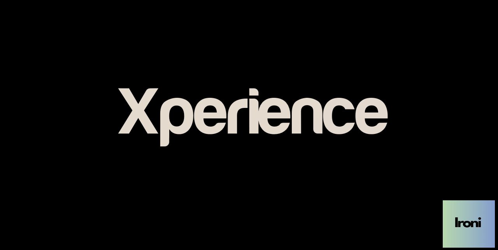

# Xperience 🎥

> Create stunning 3D cinematic videos with ease - Your vision, your story!

## 🌟 Overview

Xperience is a powerful, user-friendly 3D cinematic video creation tool designed for everyone - from beginners to professional content creators. Transform your ideas into stunning visual experiences with our intuitive interface and professional-grade features.

## ✨ Features

- 🎨 **Intuitive 3D Editor** - Easy-to-use interface for creating stunning 3D scenes
- 🎬 **Cinematic Tools** - Professional camera movements and transitions
- 🌈 **Rich Effects Library** - Pre-built effects and animations
- 🎭 **Asset Management** - Organized library for all your 3D models and resources
- 📱 **Cross-Platform** - Available for Windows, macOS, and Linux
- 🤝 **Community Support** - Share and collaborate with other creators

## 🚀 Getting Started

### Prerequisites

- Operating System: Windows 10/11, macOS 10.15+, or Linux
- GPU: DirectX 11 or OpenGL 4.0 compatible graphics card
- RAM: Minimum 8GB (16GB recommended)
- Storage: 2GB available space

### Installation

1. Download the latest version from our [releases page](https://github.com/manugeni/xperience/releases)
2. Run the installer for your platform
3. Launch Xperience and start creating!

## 📖 Documentation

Visit our [Wiki](https://github.com/manugeni/xperience/wiki) for detailed documentation, tutorials, and guides.

## 🎓 Tutorials

- [Getting Started Guide](docs/getting-started.md)
- [Basic Scene Creation](docs/basic-scene.md)
- [Advanced Effects](docs/advanced-effects.md)
- [Exporting Your Project](docs/export-guide.md)

## 🤝 Contributing

We welcome contributions! Please see our [Contributing Guidelines](CONTRIBUTING.md) for details.

1. Fork the Project
2. Create your Feature Branch (`git checkout -b feature/AmazingFeature`)
3. Commit your Changes (`git commit -m 'Add some AmazingFeature'`)
4. Push to the Branch (`git push origin feature/AmazingFeature`)
5. Open a Pull Request

## 📝 License

This project is licensed under the MIT License - see the [LICENSE](LICENSE) file for details.

## 🌟 Support

- 📫 Report bugs through our [Issue Tracker](https://github.com/manugeni/xperience/issues)
- 💬 Join our [Discord Community](https://discord.gg/xperience)
- 📧 Contact us at: [support@xperience.dev](mailto:support@xperience.dev)

## 🙏 Acknowledgments

- Thanks to all our contributors and supporters
- Special thanks to the open-source community
- Built with love for content creators worldwide

---

Made with ❤️ by Rendani

